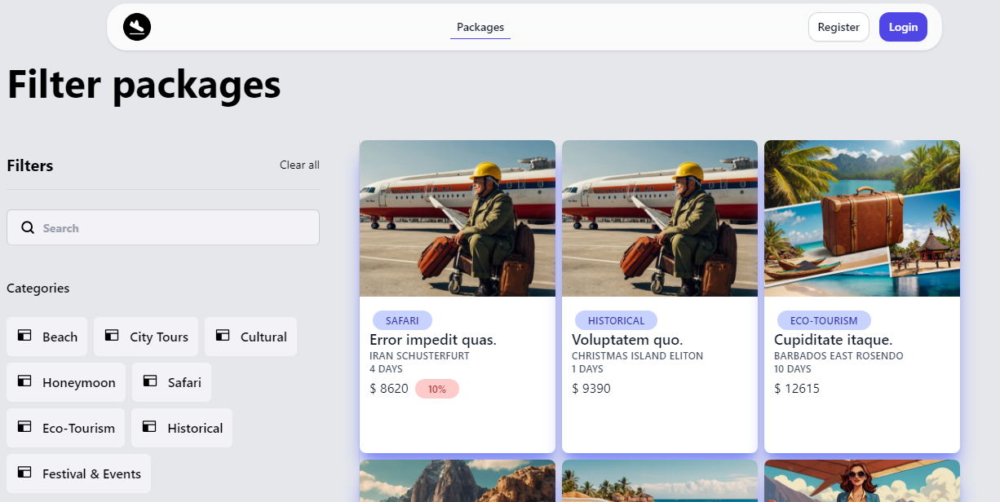

# 🌐 Aventuro

Aventuro is a travel agency web application that allows users to explore travel packages, make reservations, and manage their accounts efficiently. With JWT authentication and various features, it provides a seamless and intuitive booking experience. 

## Content

- [Demo](#demo)
- [Technologies](#technologies)
- [Installation](#installation)


## Demo

[Watch Video](https://youtu.be/enFP3gEd3sQ)

### Frontend
| |  |  |  |
| ------------------------------- | --------------------------------------- | ------------------------------------- | --------------------------------------- | 

### Backend

| |  |  |  |
| ------------------------------- | --------------------------------------- | ------------------------------------- | --------------------------------------- | 

## Technologies
| Backend (Laravel)  | Frontend (Vue ) |
|--------------------|------------------------|
| Laravel 11        | Vue.js 3               |
| MoonShine 2       | Tailwind CSS           |
| MySQL            | Pinia                   |
| JWT               |                        |


## Requirements

| Package                              | Version |
| ------------------------------------ | ------- |
| [Composer](https://getcomposer.org/) | V2.4.1  |
| [PHP](https://www.php.net/)          | V8.3.6  |
| [MySQL](https://www.mysql.com/)      | V8.0.30 |

---

## Installation
Here is how you can run the project locally:

1. Clone the repository

```bash
git clone https://github.com/estivenm0/aventuro.git
cd aventuro
```

###  Backend

```bash
cd backend
cp .env.example .env
composer install
php artisan jwt:secret
php artisan key:generate
php artisan migrate --seed
php artisan storage:link
```

### Frontend

```bash
cd frontend
npm install
npm run dev
```


## Database


