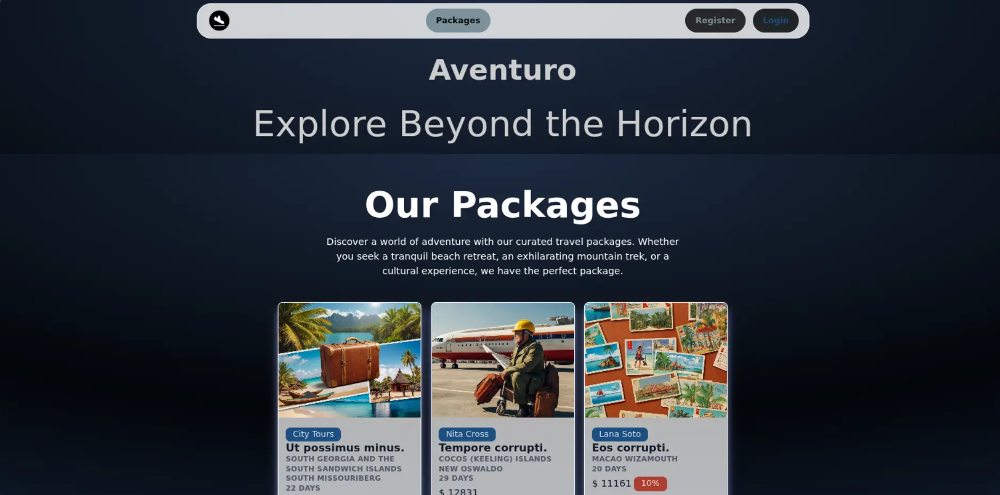
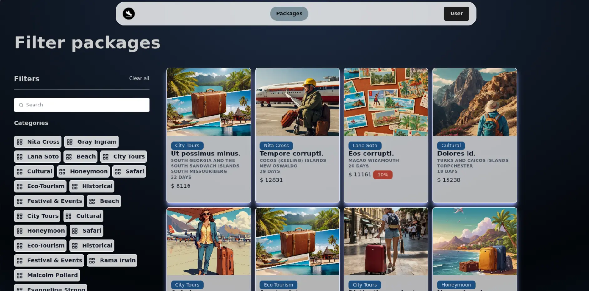
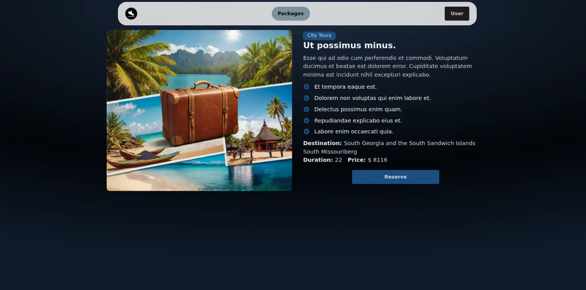
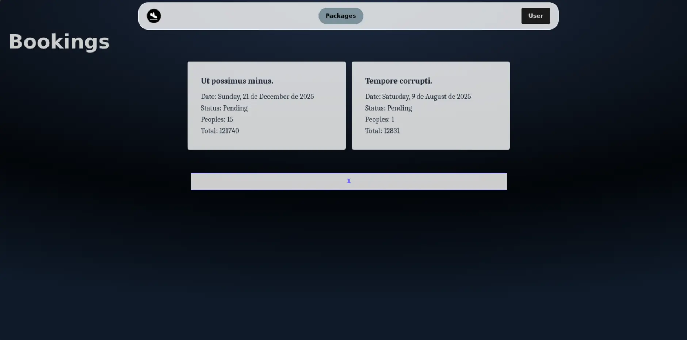
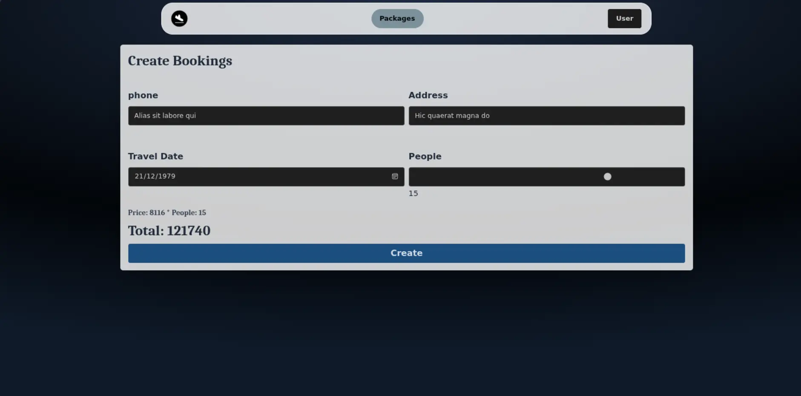
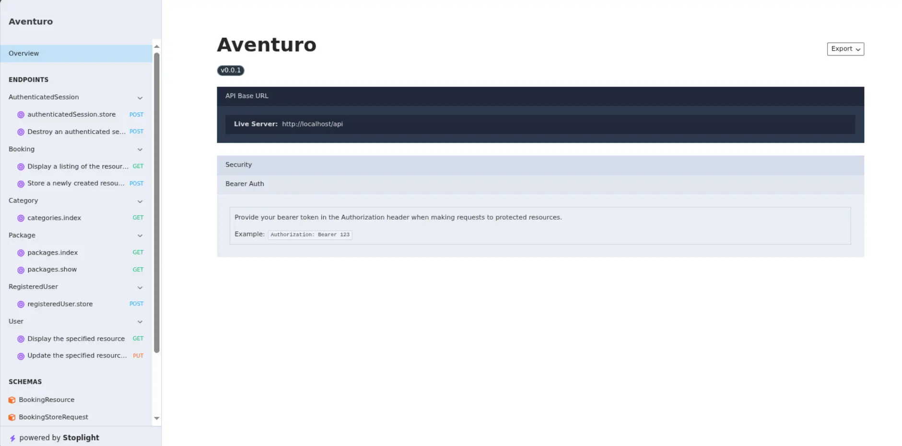
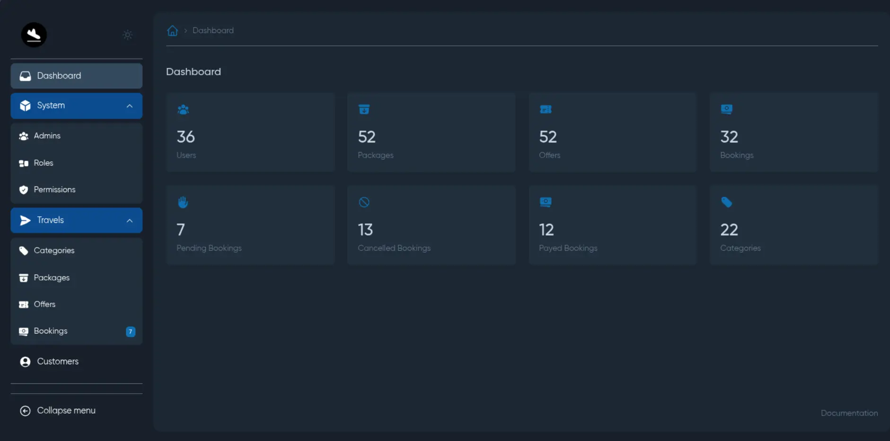
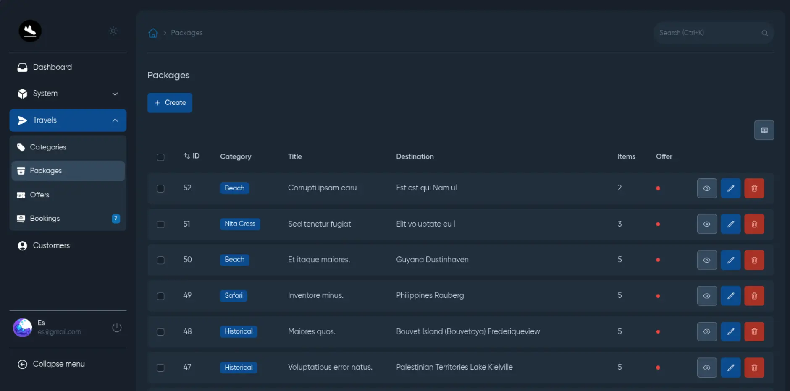
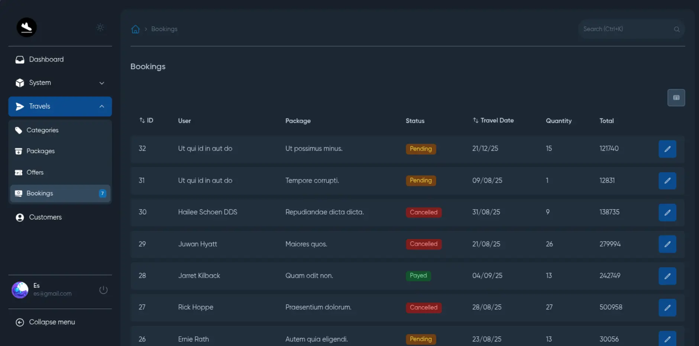

# 🌐 **Aventuro**

Aventuro is a travel agency web application where users can explore travel packages, make reservations, and manage their accounts efficiently.  
It uses **JWT authentication** and offers a seamless, intuitive booking experience.

[📖 Documentation](./_docs/README.md)

## 📦 **Tech Stack**
**Backend:** Laravel 11, Internachi Modular 2, MoonShine 3, JWT-Auth 2, Scramble 0.11  
**Frontend:** Vue 3, Pinia 2, DaisyUI 5  
**Tools:** PHP 8.2, MySQL 8

---

## 🚀 **Demo**

### 🔸 **Frontend**

|  |  |  |  |
| :-------------------------------------: | :-----------------------------------: | :-------------------------------------: | :-----------------------------------: |

### 🔸 **Backend**

|  |  |  |  |
| :-----------------------------------: | :--------------------------------------------------: | :------------------------------------------------: | :------------------------------------------------: |
