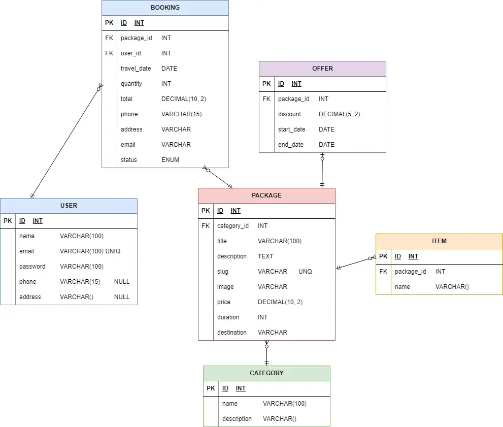

## 🚀 **Installation**

## 📦 **Stack & Packages**

| **Category** | **Technology / Package** | **Description**           |
| ------------ | ------------------------ | ------------------------- |
| **Backend**  | Laravel v11              | Core backend framework    |
|              | Internachi Modular v2    | modular setup             |
|              | MoonShine v3             | Admin panel               |
|              | Dedoc Scramble v0.11     | Doc Api                   |
|              | JWT-Auth v2              | JWT Authentication        |
| **Frontend** | Vue.js v3                | Frontend framework        |
|              | Pinia v2                 | State management          |
|              | DaisyUI v5               | Components framework      |
| **Tools**    | PHP v8.2                 | Runtime                   |
|              | MySQL v8                 | Database                  |

Follow these steps to run the project locally:

### 1️⃣ **Clone the Repository**
```bash
git clone https://github.com/maycolmunoz/aventuro.git
cd aventuro
````

---

### 2️⃣ **Backend Setup**

```bash
cd backend
cp .env.example .env
composer install
php artisan jwt:secret
php artisan launch:install
php artisan storage:link
```

#### 📂 **Backend Routes**

* **Admin Panel:** `/admin`
* **API Documentation:** `/docs/v1`

---

### 3️⃣ **Frontend Setup**

```bash
cd frontend
npm install
npm run dev
```

---

## 🗄️ **Database Diagram**



